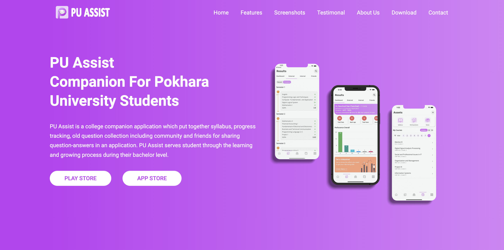

# PU Assist Website Clone

This project is a clone of the PU Assist website created for practice purposes. It aims to replicate the layout, design, and functionality of the original website using HTML and CSS.

## Features

- Responsive design for various screen sizes.
- Navigation bar with links to different sections of the website.
- Sections for showcasing courses, events, testimonials, etc.
- Footer with contact information and social media links.

You can see a live demo of this project [here](https://hunter109.github.io/PU-Assist/)

## Technologies Used

- HTML5
- CSS3

## Installation

To get started with this project, follow these steps:

1. Clone the repository to your local machine:

```bash
https://github.com/Hunter109/PU-Assist.git
```

2. Navigate to the project directory:

```bash
cd PU-Assist
```

3. Open the `index.html` file in your preferred web browser to view the website.

That's it! You're ready to explore the Apna College website clone.

## Screenshots



## Contributing

Contributions are welcome! Feel free to fork the repository and submit pull requests with improvements or bug fixes.

## License

This project is licensed under the [MIT License](https://opensource.org/licenses/MIT) - see the [LICENSE](LICENSE) file for details.
